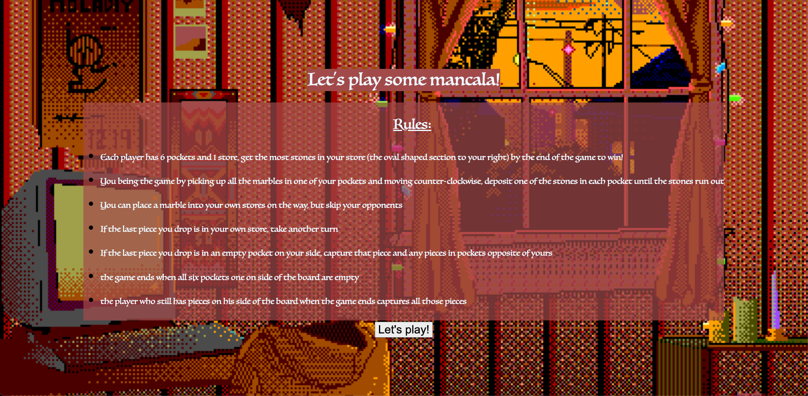
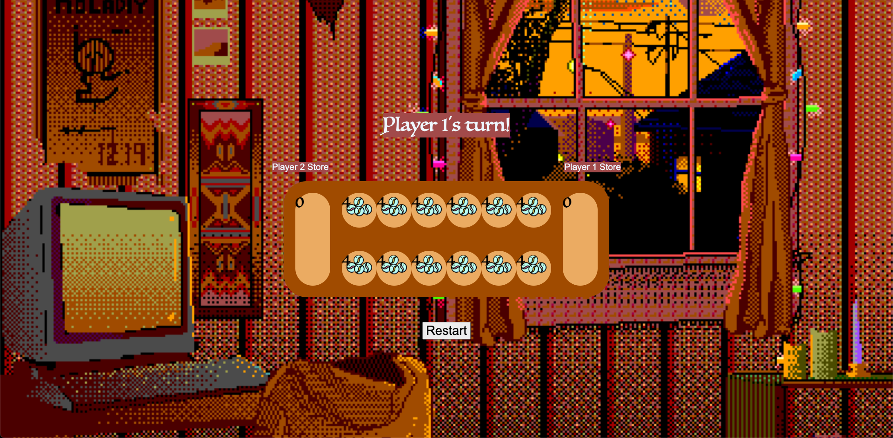
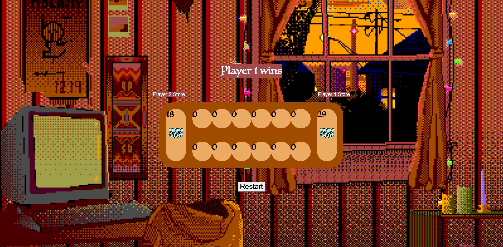

# Mancala
# Date: 1/22/2023
## By: Freddy Caione
### [Linkedin](https://www.linkedin.com/in/frederick-caione-b699821b9/) | [Github](https://github.com/fcaione)

***

## ***Description***
### Emulating the iconic 2 player tactical board game, my program strives to create a clean and cozy interface for web-browser mancala. Win the game by having the most marbles in your store at the end!

***

## ***Technologies Used*** 
* HTML
* CSS
* JavaScript

***

## ***Getting Started***
### Press start game to begin the game. Click any pocket on your side of the board to being moving marbles. If the last marble you drop ends up in your store, get a free turn, otherwise player 2 begins their turn. Get the most stones in your store by the end of the game.
### The game ends when all six pockets on one side of the board are empty, the player who still has pieces on his side of the board when the game ends captures all those pieces.

***

## Try it out: [Mancala](https://cozy-mancala.surge.sh/)

***

## ***Screenshots***
### Landing Page

### Game Start

### Win Screen

***
## ***Future Updates***
- [ ] Create an AI with varying difficulties
- [ ] Options for changing background image/theme and images for pieces
- [ ] Floating text for captures and extra turns 

***

## ***Credits / Links***

### **Rules based off of** [Endlessgames](https://endlessgames.com/wp-content/uploads/Mancala_Instructions.pdf)
### <a href="https://www.flaticon.com/free-icons/marbles" title="marbles icons">Marbles icons created by Freepik - Flaticon</a>
### **Background gif** [geographyofrobots](https://pin.it/1xcknFl)